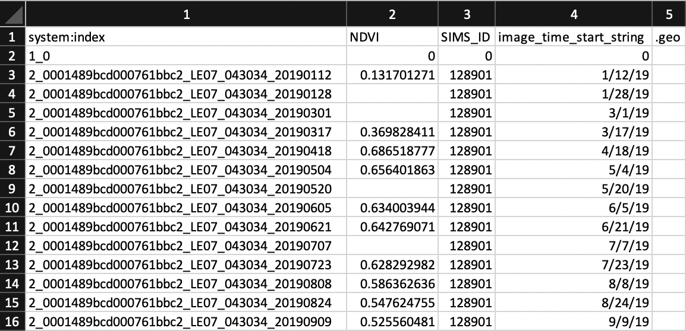

# Data Acquisition
>
>
> ## Introduction
> This [document](https://docs.google.com/document/d/1TTolXOjy3UQUG_UKBN5ror2HNB1JjmtVScBrJW-CjHo/edit#heading=h.jpm77k4o3md1) will guide you through the process of extracting the average NDVI of a given set of polygons of farm field boundaries, formatting the extracted files for analysis, and creating pivot tables. You will be using the Google Earth Engine Python API to do the extraction and Python to do the rest.
>
> The goal here is to obtain properly formatted ndvi time series data in .csv format for the input. It will look something like this:
> 
